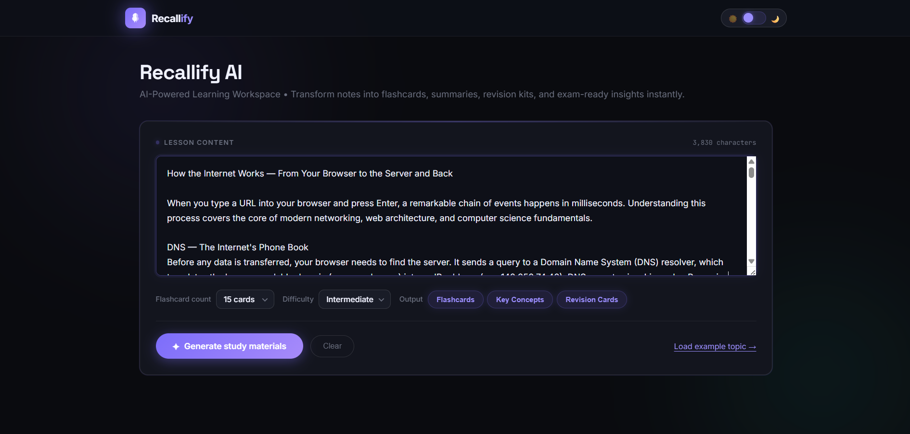
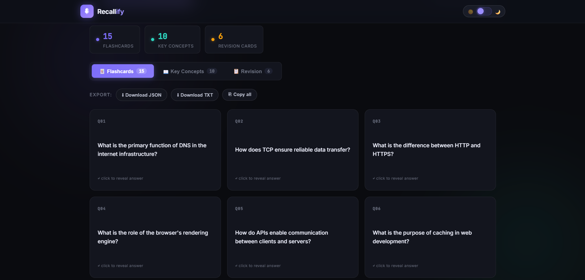
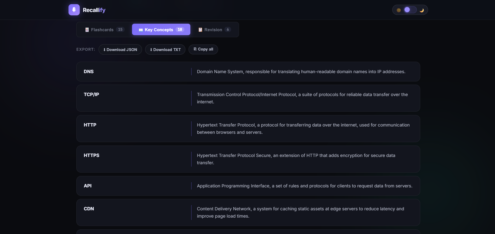
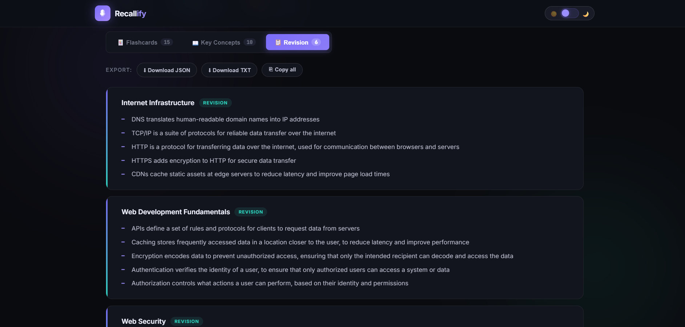

# Recallify AI

> AI-powered study assistant that converts notes and lesson content into flashcards, key concepts, quizzes, and revision summaries — instantly.

[](https://recallify-ai-799z.vercel.app/)
[](LICENSE)
[]()
[](https://vercel.com)

---

## Overview

Recallify AI reduces the manual effort involved in preparing study materials. Students paste or type any lesson content, and the application uses **Groq's Llama 3.3 70B Versatile** model to generate structured, ready-to-use study resources in seconds.

The tool generates five output types from a single input:

| Output Type | Description |
|---|---|
| **Flashcards** | Q&A pairs for active recall practice |
| **Key Concepts** | Glossary-style term and definition extraction |
| **Revision Cards** | Bullet-point summaries for quick review |
| **MCQs** | Multiple-choice questions for self-assessment |
| **Practice Questions** | Open-ended questions for deeper understanding |

---

## Demo

**Live application:** https://recallify-ai-799z.vercel.app/

### Lesson Text Input


### Flashcards Output


### Key Concepts Output


### Revision Cards Output


---

## Architecture

```
User Input (lesson text / topic)
        │
        ▼
Frontend — HTML + CSS + Vanilla JS
        │
        ▼
Vercel Serverless Function (api/generate.js)
        │  Secure API key handling
        ▼
Groq API — Llama 3.3 70B Versatile
        │  Structured prompt → JSON response
        ▼
Parsed & Validated Output
        │
        ▼
Interactive Study Materials UI
```

The frontend constructs a structured prompt based on the user's input, selected difficulty, and desired output type. The Vercel serverless function acts as a secure proxy — the Groq API key is never exposed to the client.

---

## Tech Stack

| Layer | Technology |
|---|---|
| Frontend | HTML5, CSS3, JavaScript (ES6) |
| AI Model | Llama 3.3 70B Versatile via Groq API |
| Backend | Vercel Serverless Functions |
| Deployment | Vercel |

---

## Features

- **Multi-output generation** — Flashcards, MCQs, Key Concepts, Revision Cards, and Practice Questions from a single input
- **Adjustable difficulty** — Beginner, Intermediate, and Advanced modes
- **Configurable flashcard count** — 10, 15, 20, or 25 cards
- **Export options** — Download as JSON, download as TXT, or copy to clipboard
- **Dark / Light mode** — Persistent theme toggle
- **Responsive design** — Works on desktop and mobile
- **Fast inference** — Low-latency responses via Groq's inference infrastructure

---

## Project Structure

```
Recallify-AI/
├── index.html          # Main application UI
├── api/
│   └── generate.js     # Vercel serverless function — Groq API proxy
├── images/
│   ├── lesson-text.png
│   ├── flashcards.png
│   ├── key-concepts.png
│   └── revision-cards.png
└── README.md
```

---

## Local Setup

**Prerequisites:** Node.js 18+, Vercel CLI, a Groq API key

```bash
# Clone the repository
git clone https://github.com/MinnaNourin/Recallify-AI.git
cd Recallify-AI

# Install Vercel CLI
npm install -g vercel

# Add environment variable
echo "GROQ_API_KEY=your_api_key_here" > .env.local

# Run locally
vercel dev
```

The app will be available at `http://localhost:3000`.

---

## Environment Variables

| Variable | Description |
|---|---|
| `GROQ_API_KEY` | Your Groq API key — obtain from [console.groq.com](https://console.groq.com) |

For production deployment on Vercel, add this via the Vercel dashboard under **Project Settings → Environment Variables**.

---

## Deployment

This project is configured for zero-configuration deployment on Vercel.

```bash
vercel --prod
```

The `api/generate.js` serverless function is automatically detected and deployed alongside the static frontend.

---

## Roadmap

- [ ] PDF and document upload support
- [ ] Export to PDF
- [ ] Spaced repetition system
- [ ] AI study planner
- [ ] User accounts and saved sessions
- [ ] Learning analytics dashboard
- [ ] Multi-language support
- [ ] Voice-based input

---

## Author

**Minna Nourin** — Aspiring AI & Data Professional

[](https://linkedin.com/in/minnanourin)
[](https://github.com/MinnaNourin)

---

## License

This project is licensed under the MIT License.
